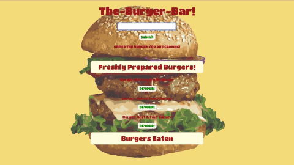

# burger

[The-Burger-Bar](https://hidden-hollows-63563.herokuapp.com/) is a Burger Ordering App using Node.js and Express Web Frameworks, Handlebars and a homemade ORM. Users can order new burgers in the input and the "eat them". It logs all burgers ordered and eaten.
It uses MySQL to query and route data to the App and Handlebars to generate the HTML. 
 

## Getting Started

- Clone Repo
- Run command in Terminal "npm install"
- Run command "npm start"
- Run "ctrl + c" to exit mode

## Technologies Utilized

- CSS3
    - Bootstrap 4.2.1
- JavaScript
    - Node.js
        - Express
        - Body-Parser
        - Nodemon
        - MySQL
        - Morgan
       

## Author

- Susye Weng-Reeder - *JavaScript/ Node.js/ Express* - [Susye Weng-Reeder](https://eveasian88.github.io/Professional-Portfolio/ "Susye's Portfolio")
